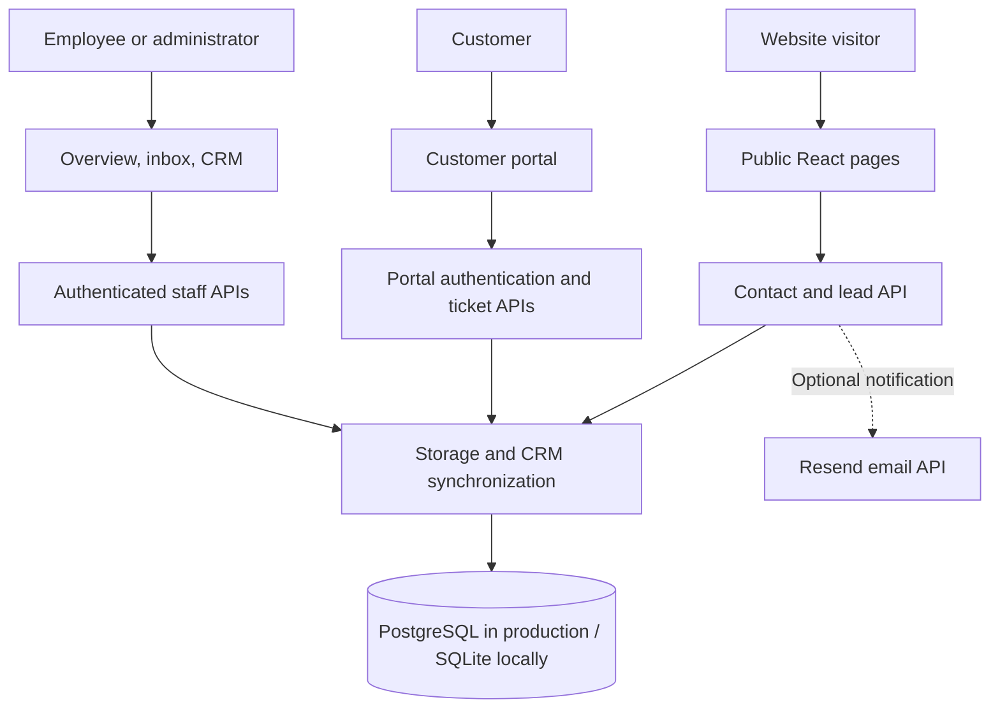

# Animus Scripts

**Operational software, workflow automation, and business intelligence—with a connected website, customer portal, and staff workspace.**

[Website](https://www.animusscripts.com) · [Customer portal](https://www.animusscripts.com/portal) · [Staff sign-in](https://www.animusscripts.com/submissions)

This repository contains the Animus Scripts web application. It introduces the consultancy's services, captures prospective customer inquiries, lets customers submit and follow support requests, and gives employees a shared workspace for managing customer records and operational work.

## What the business does

Animus Scripts helps businesses replace repetitive tasks, disconnected spreadsheets, and email-based handoffs with focused software and reliable reporting.

| Service | Business purpose | Examples of client work |
| --- | --- | --- |
| Workflow automation | Reduce manual entry and keep requests moving | Form intake, routing, email and Teams notifications, processing logs |
| Business intelligence | Give teams consistent operational metrics | SQL models, Power BI dashboards, KPI reporting, refresh automation |
| Internal business applications | Simplify approvals and daily operations | Request trackers, approval tools, production data entry, role-based interfaces |
| Systems integration | Connect existing systems and reduce duplicate work | APIs, Microsoft Graph, SQL synchronization, ERP reporting, ETL pipelines |
| Microsoft 365 and identity systems | Improve collaboration and access administration | SharePoint structure, Active Directory groups, access workflows, distribution processes |

The website explains the delivery process, from understanding a workflow through designing, building, and improving a system. Service pages, example projects, pricing information, and an ROI calculator help visitors evaluate an engagement and describe their needs.

Power BI, SharePoint, SQL Server, MySQL, and Microsoft Graph describe consultancy capabilities. They are not all dependencies of this web application.

## Website and business functionality

### Public website

- Homepage introducing the business, operational problems, services, and delivery approach.
- Service catalog and detailed pages for each service.
- Example systems/projects, company information, pricing comparisons, and ROI estimates.
- Contact and lead-capture forms backed by a first-party API and database.
- Optional email notifications and Google Analytics page-view/contact-conversion tracking.
- Responsive layouts, shared CSS styling, scroll animations, and toast feedback.

### Customer portal

Customers can create an account, sign in, submit tickets, review their own requests, inspect status and history, and add replies. Replies appear in the timeline used by staff.

Portal authentication uses signed HTTP-only cookies. Server-side ownership checks restrict customers to their own tickets. Customer accounts and staff accounts use separate authentication flows.

### Staff Overview

The authenticated dashboard summarizes active and unassigned work, recent intake, CRM coverage, ticket health, recent requests, and recorded operational activity. It is the starting point for identifying work that needs attention.

### Ticket Inbox / Submissions

- Search customer requests and filter by status or ownership, including requests assigned to the current employee.
- Review request details, source, owner, and history.
- Assign teammates and update lifecycle status with an optional note.
- Save internal CRM notes and create follow-up tasks with due dates.
- Inspect CRM activity and assignment history.
- Export the loaded ticket collection to CSV.
- Create staff accounts and review roles when signed in as an administrator.

`/submissions` is the staff sign-in and inbox entry point. `/admin` is an alias that redirects there in production.

### CRM Records

The CRM screen supports listing, searching, creating, editing, and deleting these record types:

| Record | Purpose |
| --- | --- |
| Organizations | Companies/accounts, including type, status, industry, and ownership |
| Contacts | People, contact information, organization relationships, and portal-account links |
| Leads | Inbound interest, source submissions, qualification stage, priority, and ownership |
| Tickets | Support/service work linked to contacts, organizations, and intake or portal requests |

Notes, tasks, and activity are available through ticket workflows. Some relationship fields currently use record IDs. The CRM page requests up to 200 records per entity and searches the loaded collection.

## Technology stack

| Layer | Technology | Purpose |
| --- | --- | --- |
| Frontend | React 19, JavaScript, JSX | Pages, forms, dashboards, and interactive UI |
| Routing | React Router 7 | Browser navigation and employee route guards |
| Build/development | Vite 6 and React plugin | Development server, local API middleware, frontend production build |
| Styling | Plain CSS | Shared design system, page styles, responsive layouts |
| Motion | Anime.js 4, react-scroll | Reveal animations and scrolling interactions |
| Backend | Node.js | API handlers, sessions, database operations, synchronization, maintenance scripts |
| Hosting | Vercel | Frontend hosting, API functions, redirects, and rewrites |
| Production storage | PostgreSQL through `pg` | Durable shared data; Neon is the documented database option |
| Local/test storage | SQLite through `better-sqlite3` | File-backed development and disposable test databases |
| Configuration | dotenv and Vite environment loading | Server settings and build-time frontend configuration |
| Staff identity | Local credentials; optional Microsoft Entra ID OAuth | Employee sign-in mapped to authorized database accounts |
| Notifications | Resend HTTP API, optional | Contact submission emails |
| Analytics | Google Analytics, optional | Client-side page views and successful contact events |
| Quality checks | ESLint 9, Node built-in test runner | Source checks and API/data workflow tests |

[package.json](package.json) declares dependency ranges; [package-lock.json](package-lock.json) records resolved versions. The frontend uses ES modules. Shared server modules use CommonJS `.cjs` files, connected through the API entry points.

## Architecture



### From inquiry to operational work

1. Contact and lead forms submit to `/api/contact`.
2. The server persists the submission and synchronizes it into CRM before completing the request.
3. Optional email notification alerts the business. Capture does not require email to be configured.
4. Portal account and ticket flows also synchronize relevant customer information into CRM.
5. Staff review incoming work, assign ownership, update status, and record follow-up information.
6. Customers track their requests and reply in the portal. Authentication outcomes and sensitive staff changes are recorded in the audit stream.

### Database behavior

`server/contactStore.cjs` handles database selection, schema initialization, record operations, password verification, CRM synchronization, and audit persistence.

PostgreSQL configuration is selected in this order: `CONTACT_DATABASE_URL`, then `POSTGRES_URL`, then `DATABASE_URL`. Without a PostgreSQL URL, development uses `data/animus-submissions.sqlite`, or `CONTACT_DB_PATH` when provided.

On Vercel, the SQLite fallback is `/tmp/animus-submissions.sqlite`. It is **not durable**; configure PostgreSQL for production.

Stored data includes original contact submissions, staff accounts, portal users/tickets, CRM entities and relationships, notes, tasks, activity, and `system_audit_events`. Additional schema foundations exist for broader operational modules; that does not mean a complete ERP interface is implemented.

## Routes and APIs

| Browser route | Screen |
| --- | --- |
| `/` | Homepage |
| `/services`, `/services/:slug` | Service catalog and details |
| `/what-we-build` | Example systems and project types |
| `/about`, `/pricing`, `/contact` | Company information, engagement pricing, and inquiry form |
| `/portal` | Customer authentication and tickets |
| `/submissions`, `/admin` | Employee sign-in and ticket inbox |
| `/admin/dashboard` | Staff Overview |
| `/admin/crm` | CRM management |

| API group | Responsibility |
| --- | --- |
| `/api/contact` | Contact and lead intake |
| `/api/admin/login`, `/api/admin/session`, `/api/admin/logout` | Staff session lifecycle |
| `/api/admin/submissions`, `/api/admin/tickets` | Staff submission/ticket access and ticket updates |
| `/api/admin/users` | Staff accounts and administrator-only user creation |
| `/api/admin/crm` | CRM record operations |
| `/api/admin/crm-actions`, `/api/admin/crm-activity` | Notes, tasks, related activity |
| `/api/admin/microsoft/start`, `/api/admin/microsoft/callback` | Microsoft employee sign-in |
| `/api/portal/signup`, `/api/portal/login`, `/api/portal/session`, `/api/portal/logout` | Customer authentication |
| `/api/portal/tickets` | Customer ticket listing, creation, details, replies |

Some URLs are aliases for shared function files. See [vercel.json](vercel.json) for production routing and [vite.config.js](vite.config.js) for local middleware.

## Local development

Run commands from the directory containing this README and `package.json`. Use npm and a Node.js version compatible with the installed Vite and `better-sqlite3` dependencies. SQLite uses a native Node module, so installation must match the runtime and platform.

```bash
npm ci
```

Create `.env.local` at the repository root. For local SQLite development:

```dotenv
ADMIN_AUTH_SECRET=replace-with-a-long-random-staff-session-secret
USER_AUTH_SECRET=replace-with-a-different-long-random-portal-session-secret
```

Create an initial administrator, replacing the example password, then start the app:

```bash
npm run admin:create -- --username admin --password "REPLACE_WITH_A_STRONG_PASSWORD" --role admin
npm run dev
```

Open the URL printed by Vite. Use `/submissions` for staff sign-in and `/portal` for customer registration. The account command creates or updates the matching username; `--role employee` creates staff without user-management privileges.

Vite serves the frontend and local API middleware together. `npm run preview` previews the frontend build and is not a replacement for the production API runtime.

### Environment variables

| Variable | Purpose |
| --- | --- |
| `CONTACT_DATABASE_URL` | Preferred PostgreSQL connection string for durable production storage |
| `POSTGRES_URL`, `DATABASE_URL` | Alternative PostgreSQL connection variables |
| `CONTACT_DB_PATH` | Optional SQLite file path |
| `ADMIN_AUTH_SECRET` | Staff session-signing secret |
| `USER_AUTH_SECRET` | Portal session secret; implementation falls back to `ADMIN_AUTH_SECRET` |
| `ADMIN_SUBMISSIONS_KEY` | Legacy internal key and fallback staff-signing secret |
| `RESEND_API_KEY` | Enables optional notification emails |
| `RESEND_FROM_EMAIL` | Sender accepted by Resend |
| `CONTACT_TO_EMAIL` | Notification recipient; defaults to `info@animusscripts.com` |
| `VITE_GOOGLE_ANALYTICS_ID` | Optional frontend analytics measurement ID |
| `MICROSOFT_CLIENT_ID`, `MICROSOFT_CLIENT_SECRET` | Optional Entra application credentials |
| `MICROSOFT_TENANT_ID` | Entra tenant; defaults to `common` |
| `MICROSOFT_REDIRECT_URI` | Optional explicit Microsoft callback URL |
| `MICROSOFT_LOGIN_PROMPT` | OAuth prompt; defaults to `select_account` |
| `ADMIN_ALLOWED_DOMAIN`, `ADMIN_ALLOWED_EMAILS` | Microsoft employee sign-in allow rules |
| `PORTAL_AUTH_MAX_ATTEMPTS` | Auth attempt threshold; default `5` |
| `PORTAL_AUTH_WINDOW_MS` | Auth attempt window; default `600000` |
| `PORTAL_AUTH_LOCK_MS` | Auth lock duration; default `900000` |

Keep credentials and `.env.local` out of Git. `VITE_` settings become available to the browser; database credentials and session secrets belong only in server configuration.

### Microsoft sign-in and access

Register an application in Microsoft Entra ID and configure the site's `/api/admin/microsoft/callback` URL. Set the Microsoft credentials and at least one staff domain/email allow rule. The Microsoft email must match an existing authorized account in `admin_users`.

Microsoft sign-in establishes identity; database authorization still controls staff access. Local passwords are stored as salted hashes. Portal sign-in includes an in-memory attempt limiter, scoped to a server instance rather than a shared distributed service.

## Commands and tests

| Command | Purpose |
| --- | --- |
| `npm run dev` | Start frontend and local API middleware |
| `npm run build` | Build production frontend into `dist/` |
| `npm run preview` | Preview the frontend build |
| `npm run lint` | Run ESLint |
| `npm test` | Run API and CRM tests |
| `npm run verify:db` | Check configured storage and durability |
| `npm run admin:create -- ...` | Create or update a staff account |
| `npm run crm:backfill` | Preview historical record synchronization |
| `npm run crm:backfill -- --apply` | Apply a reviewed backfill |

Tests in `test/apiFlow.test.cjs` and `test/crmSync.test.cjs` use disposable SQLite databases. Coverage includes CRM synchronization, repeatable backfills, customer isolation, ticket status/assignment updates, replies/timelines, audit events, and administrator-only user creation.

Backfill is a read-only dry run by default. Review its summary before applying it to the configured database. It is designed to be repeatable without duplicating synchronized records.

## Deployment

The repository targets Vercel: Vite builds the frontend, `api/` supplies server functions, and `vercel.json` configures redirects, API aliases, and the single-page application fallback.

1. Connect the repository and use its root as the project directory.
2. Set the build command to `npm run build` and frontend output to `dist`.
3. Configure PostgreSQL, such as Neon, and set `CONTACT_DATABASE_URL` in the intended Vercel environment.
4. Set staff/portal secrets and any optional email, analytics, or Microsoft settings.
5. Provision staff against the intended database. Maintenance scripts load `.env.local`; confirm its target before running them.
6. Deploy and verify contact capture, staff sign-in, CRM records, and a customer ticket/reply flow.

Run `npm run verify:db` against the intended configuration to confirm `backend: "postgres"` and `durable: true`. Frontend environment changes, including analytics IDs, require a new build.

## Repository guide

```text
api/                     Production API entry points
server/                  Shared backend, persistence, sessions, maintenance scripts
src/Pages/               Public pages, portal, Overview, inbox, CRM
src/Components/          Shared UI, admin shell, forms, navigation, ROI calculator
src/data/siteContent.js  Services, project examples, business content
src/styles/              Shared visual design system
src/utils/               Analytics and UI event helpers
src/hooks/               Animation and scroll helpers
test/                    API workflow and CRM synchronization tests
vite.config.js           Frontend build and development API middleware
vercel.json              Production redirects and rewrites
```

## Scope and roadmap

The implemented application combines consultancy marketing, intake, customer tickets, staff operations, and a CRM interface. Broader opportunity management and ERP-style project, approval, and operational workflows are expansion work. Schema scaffolding and planning documents do not imply that every module is a finished user-facing feature.

- [CRM-to-ERP roadmap](CRM-ERP-Next-Steps.md)
- [Execution checklist](CRM-ERP-Execution-Checklist.md)
- [Data model planning](CRM-ERP-Data-Model.md)

Use application code and tests as the source of truth for implemented behavior; the planning documents also contain proposed future work.
